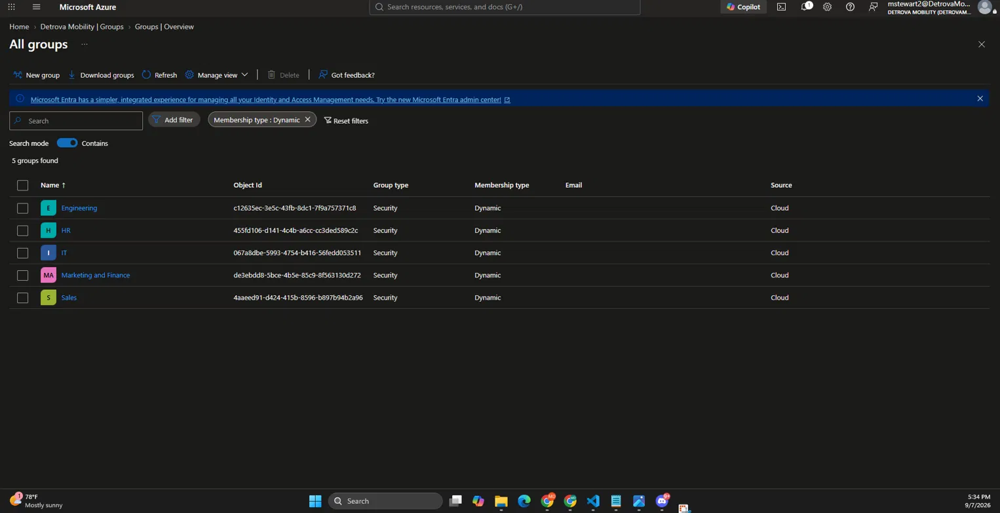
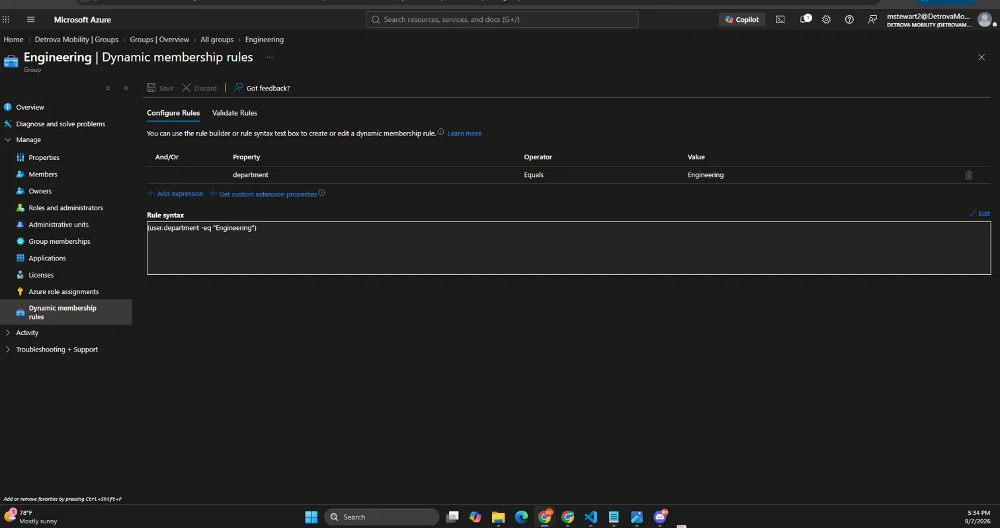
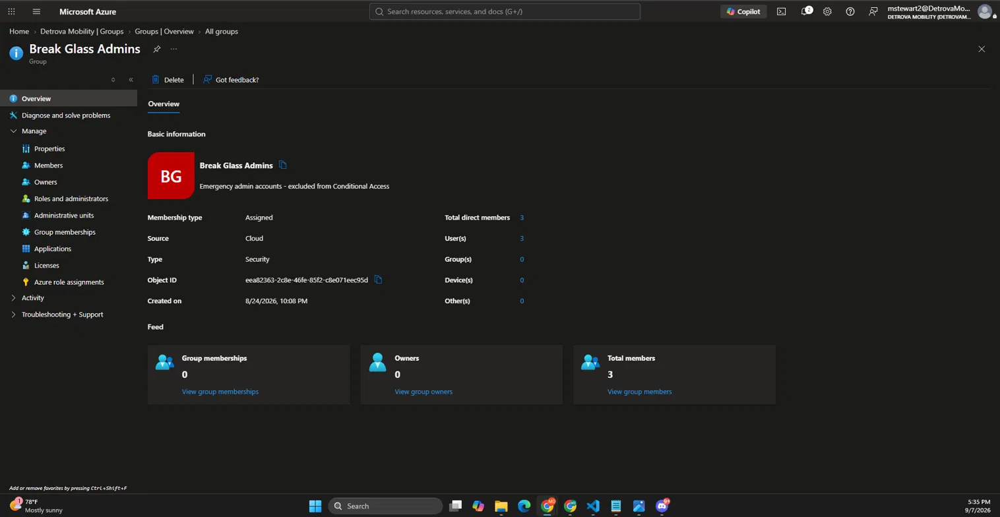
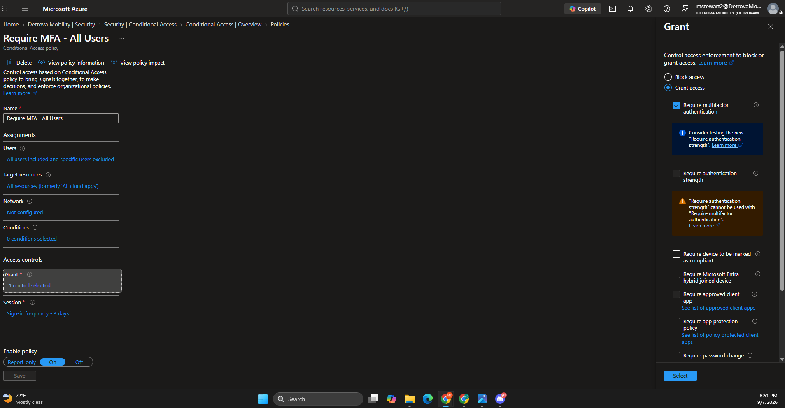

# Walkthrough

A visual tour of the Detrova Mobility Zero Trust IAM lab, showing the key pieces I built and configured in Microsoft Entra ID.

---

### 1. Entra ID Tenant Overview

This is the Entra ID dashboard for Detrova Mobility. It shows the tenant with 123 users, 14 groups, and a Microsoft Entra ID P2 license.

---

### 2. Groups Overview

The Groups overview. Out of 14 total groups, 5 are dynamic, meaning they fill themselves automatically instead of being managed by hand.

---

### 3. The Five Dynamic Groups

The 5 dynamic security groups: Engineering, HR, IT, Marketing and Finance, and Sales. Each one is cloud-based and populates by department.

---

### 4. How a Dynamic Group Fills Itself

This is the rule behind a dynamic group. Anyone whose department equals "Engineering" is added automatically, with no manual work.

---

### 5. Break Glass Admins

The Break Glass Admins group: 3 emergency accounts, excluded from all Conditional Access so a broken policy can never lock everyone out of the tenant.

---

### 6. Conditional Access Policies

This is my Conditional Access section, with all 6 security policies I built. Each one is a rule that decides who gets in and under what conditions, covering MFA, device compliance, blocking risky sign-ins, and protecting admin activation.

---

### 7. Require MFA for All Users

This is my "Require MFA" policy for all users. A password alone isn't enough since passwords get stolen or guessed, so MFA adds a second proof of identity. Even if someone steals a password, they still can't get in without it.

---

### 8. Phishing-Resistant MFA for Engineering and IT

This is my phishing-resistant MFA policy, applied only to Engineering and IT. Regular MFA already protects everyone well; this adds an extra layer for the highest-risk teams. It's bound to the real site and device, so it holds up even against advanced phishing.

