# Walkthrough

A visual tour of the Detrova Mobility Zero Trust IAM lab, showing the key pieces I built and configured in Microsoft Entra ID and Intune.

---

### 1. Entra ID Tenant Overview

This is the Entra ID dashboard for Detrova Mobility. It shows the tenant with 123 users, 14 groups, and a Microsoft Entra ID P2 license.

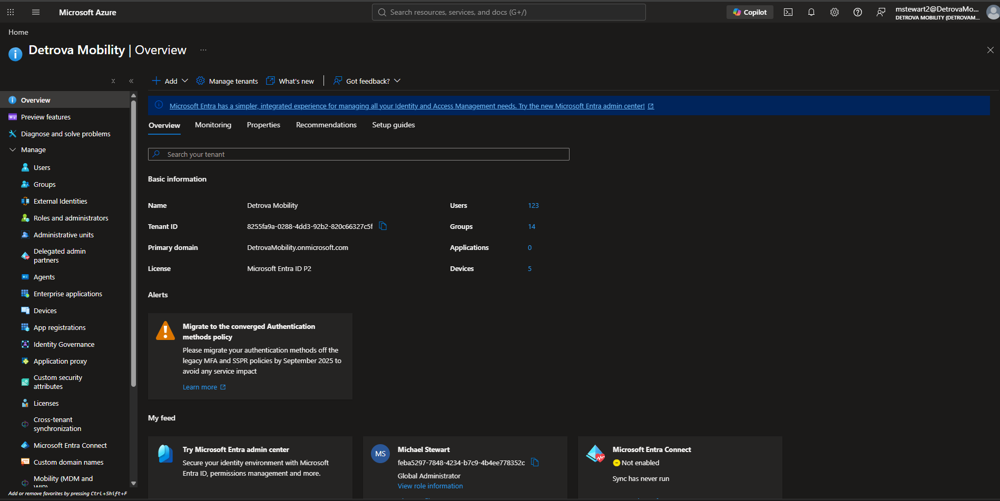

---

### 2. Groups Overview

The Groups overview. Out of 14 total groups, 5 are dynamic, meaning they fill themselves automatically instead of being managed by hand.

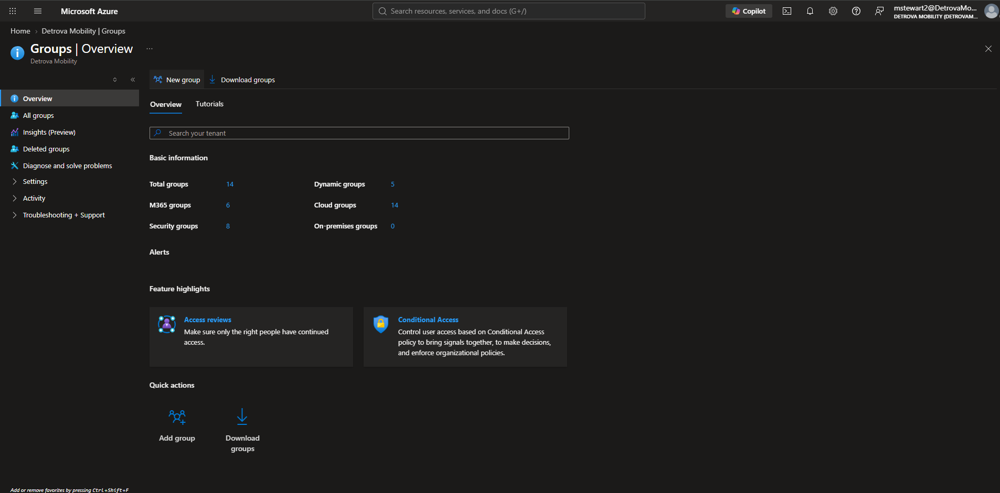

---

### 3. The Five Dynamic Groups

The 5 dynamic security groups: Engineering, HR, IT, Marketing and Finance, and Sales. Each one is cloud-based and populates by department.

---

### 4. How a Dynamic Group Fills Itself

This is the rule behind a dynamic group. Anyone whose department equals "Engineering" is added automatically, with no manual work.

---

### 5. Break Glass Admins

The Break Glass Admins group: 3 emergency accounts, excluded from all Conditional Access so a broken policy can never lock everyone out of the tenant.

---

### 6. Conditional Access Policies

This is my Conditional Access section, with all 6 security policies I built. Each one is a rule that decides who gets in and under what conditions, covering MFA, device compliance, blocking risky sign-ins, and protecting admin activation.

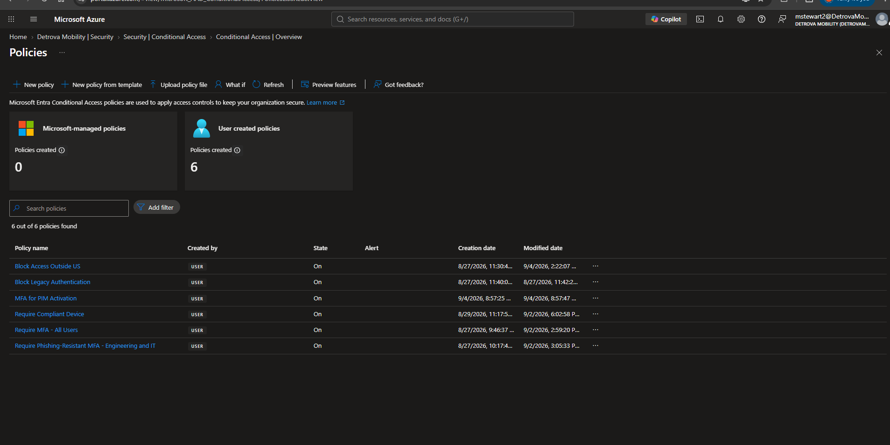

---

### 7. Require MFA for All Users

This is my "Require MFA" policy for all users. A password alone isn't enough since passwords get stolen or guessed, so MFA adds a second proof of identity. Even if someone steals a password, they still can't get in without it.

---

### 8. Phishing-Resistant MFA for Engineering and IT

This is my phishing-resistant MFA policy, applied only to Engineering and IT. Regular MFA already protects everyone well; this adds an extra layer for the highest-risk teams. It's bound to the real site and device, so it holds up even against advanced phishing.

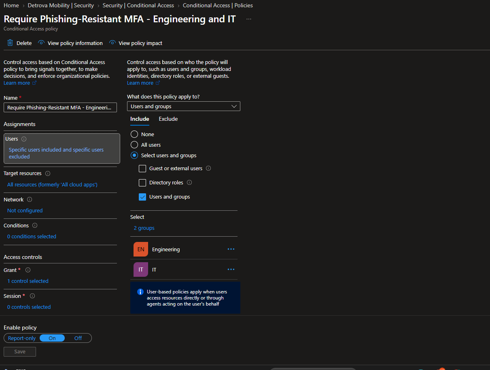

---

### 9. Block Access Outside the US

This is my "Block Access Outside US" policy. Since Detrova is mainly a US-based company, it blocks any sign-in from outside the country. But notice the exclusions: Approved International Travelers and the Break Glass Admins are exempt, so approved business travel and emergency access still work while everyone else stays protected.

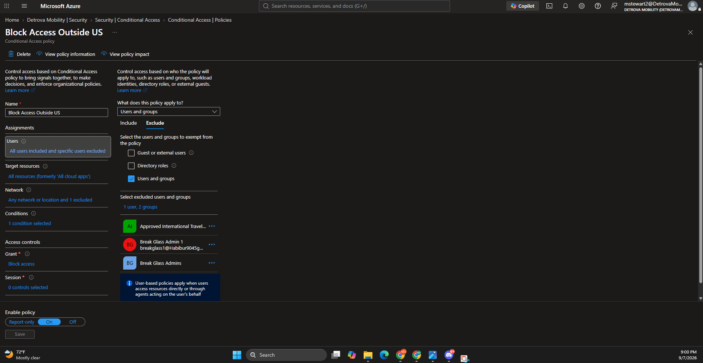

---

### 10. The Named Location Behind the Block

This is the "named location" that powers the policy above. I defined the United States as a location using its IP ranges, and the Block Access Outside US policy points at it. Together they answer the question "where is this sign-in coming from?" and act on the answer.

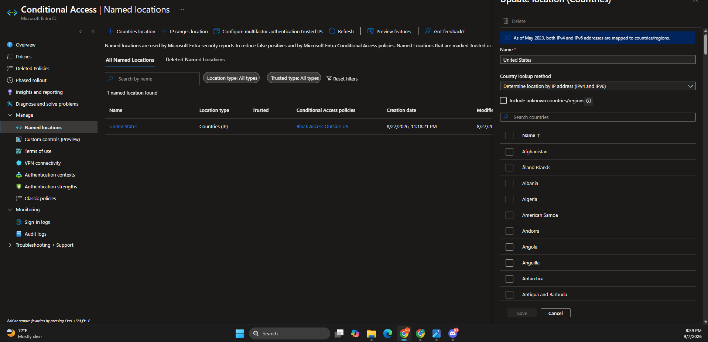

---

### 11. Require a Compliant Device

This is my "Require Compliant Device" policy. It only lets a device in if Intune has labeled it compliant. But the policy itself doesn't check the device, it just reads the label and enforces it: compliant gets in, not compliant gets blocked.

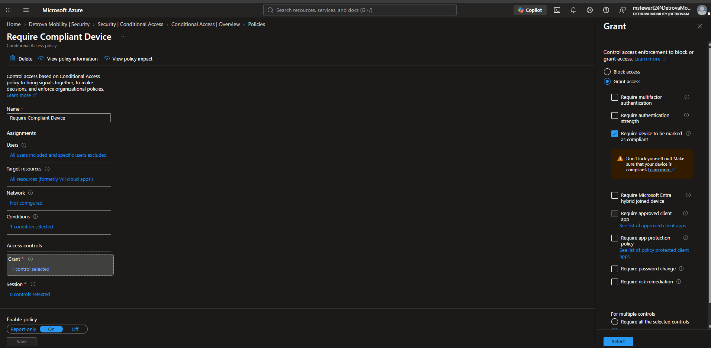

---

### 12. The Intune Compliance Baseline

This is the Intune compliance policy that creates the label the policy above depends on. It's the health checklist every device must pass: firewall on, antivirus, TPM, and Microsoft Defender all required. Intune checks and labels the device; Conditional Access enforces it. The two work as a team.

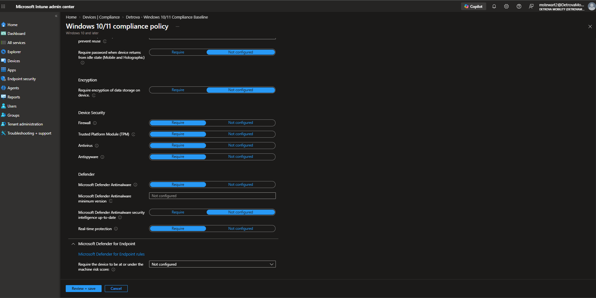

---

### 13. Just-in-Time Admin with PIM

This is PIM (Privileged Identity Management) for the Helpdesk Administrator role. Instead of admins holding power 24/7, which is risky if an account gets hacked, these three users are only *eligible*. Their admin power is off by default and only turns on when they request it, then shuts off automatically.

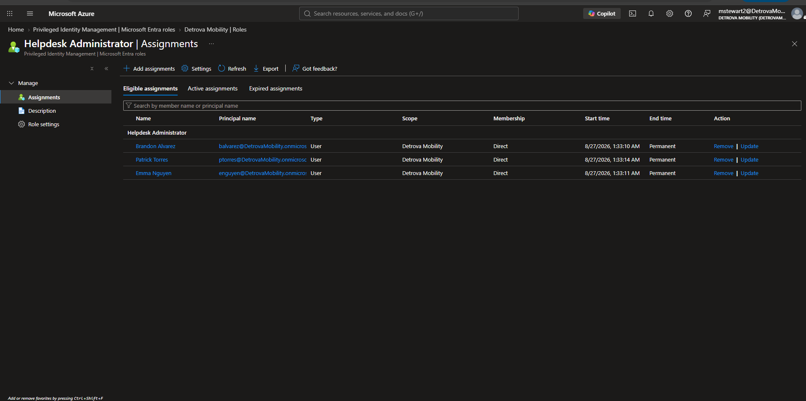

---

### 14. PIM Role Settings

These are the rules behind that role. Activation lasts a maximum of 8 hours, requires a justification, and, most importantly, "On activation, require" is set to the MFA authentication context. So turning on admin power is never just a click.

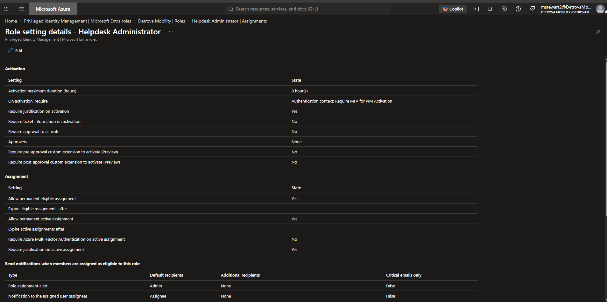

---

### 15. The Authentication Context

This is the authentication context I built, basically a label that means "extra verification required." On its own it does nothing; it's the trigger that a Conditional Access policy watches for.

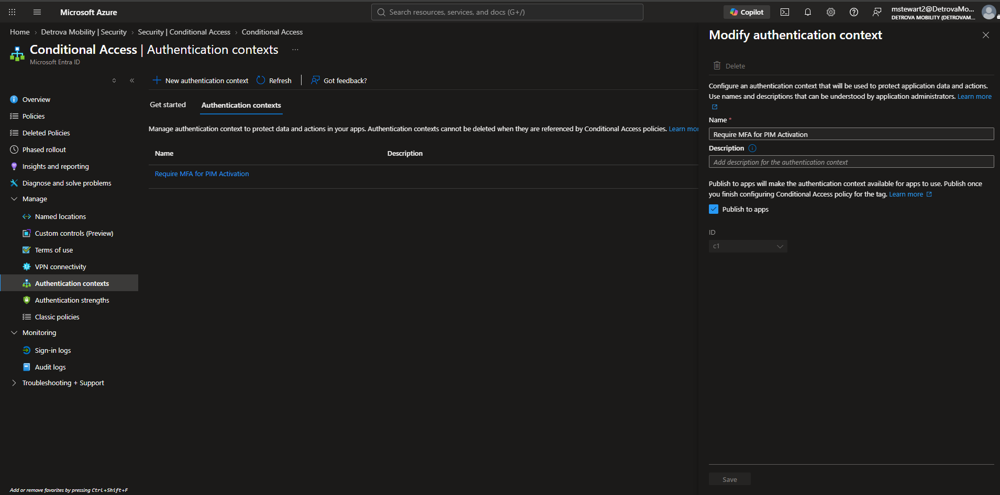

---

### 16. Forcing MFA on Admin Activation

This is the Conditional Access policy that watches for that label and forces MFA whenever it's triggered. Tied to the PIM role, it means activating admin access always demands fresh MFA. This connects my identity, security rules, and admin access into one system.

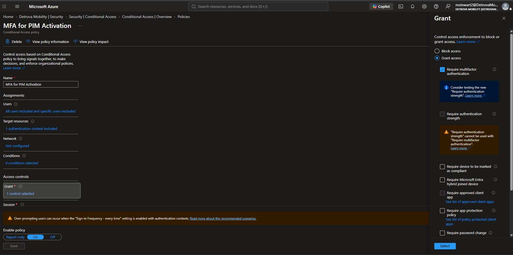
